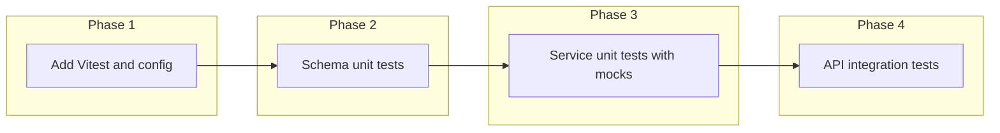

# Backend clients feature – test plan (TDD workflow)

## Current state

- **Backend:** No test runner; `"test": "echo \"Error: no test specified\" && exit 1"` in [backend/package.json](backend/package.json).
- **Clients feature:** Four files: [clients.service.ts](backend/src/features/clients/clients.service.ts), [clients.controller.ts](backend/src/features/clients/clients.controller.ts), [clients.schemas.ts](backend/src/features/clients/clients.schemas.ts), [clients.routes.ts](backend/src/features/clients/clients.routes.ts). Logic lives in the service (Prisma); controller is thin; validation is Zod in schemas.

## Findings that may be bugs

1. **updateClient workspace check**

[clients.service.ts](backend/src/features/clients/clients.service.ts) uses `findById(tx, id)` (no workspace filter). If the client exists in another workspace, the code does not throw; it calls `tx.client.update({ where: { id, workspaceId } })`, which matches 0 rows and can lead to a Prisma error instead of a consistent 404. **deleteClient** correctly checks `existingClient.workspaceId !== workspaceId` and throws `EntityNotFoundError`. Recommendation: add a test that expects 404 when updating a client that belongs to another workspace; if it fails, fix by adding the same workspace check as in deleteClient.

2. **Soft delete vs hard delete**

Comment says "soft delete", but [clients.service.ts](backend/src/features/clients/clients.service.ts) uses `tx.client.delete()`, which removes the row. **listClients** and **getClientBySequence** filter by `deletedAt: null`, which implies soft-deleted rows should remain. Recommendation: add a test that after "delete" the client is not returned by list/get (and optionally that `deletedAt` is set if we switch to soft delete). Then either implement soft delete (set `deletedAt`) or fix the comment to say hard delete.

---

## Workflow we will follow

Per [.cursor/rules/tdd-workflow.mdc](.cursor/rules/tdd-workflow.mdc):

- **Unit tests** for: pure logic and validation (Zod schemas), and service behavior with **mocked Prisma** (no real DB).
- **Integration tests** for: HTTP API (routes + controller + service with mocked Prisma, and optionally test DB later). No E2E for backend-only.

For each new behavior: **RED** (write failing test, run, confirm failure) → **GREEN** (minimal code) → **REFACTOR** (if needed). For existing code we will write tests that specify the intended behavior; if the implementation is wrong (e.g. bugs above), the test will fail and we fix the implementation.

---

## Phase 1: Test setup

- Add **Vitest** to the backend (good TypeScript/ESM support, fast, simple).
- Add scripts in `package.json`: e.g. `test`, `test:unit`, `test:integration`.
- Add a minimal `vitest.config.ts` (or equivalent) so we can run tests with correct paths and env (e.g. `src` and `generated`).
- No production code changes; this is tooling only.

---

## Phase 2: Unit tests – schemas

**File:** `backend/src/features/clients/clients.schemas.test.ts` (or `__tests__/clients.schemas.test.ts`).

Test the Zod schemas (validation only; no Prisma). One behavior per test; clear names.

| Schema | Behaviors to test |

| ----------------------------- | ----------------------------------------------------------------------------------------------------------------------------------------------------------------------------------------------------------- |

| **listClientsSchema** | Defaults: missing query → `page=1`, `limit=10`; invalid: `page=0` or `limit=0` or `limit>30` fail; valid: `search` optional string. |

| **getClientBySequenceSchema** | Valid: positive integer; invalid: zero, negative, non-number. |

| **getClientByIdSchema** | Same idea as sequence: positive integer required. |

| **createClientSchema** | Required: `name` (non-empty, max 255), `email` (valid email). Optional but validated when present: `phone` (E.164-style regex), `address`/`nit`/`businessName` (lengths). Reject empty name, invalid email. |

| **updateClientSchema** | All fields optional (partial); when provided, same rules as create. |

Workflow: write one failing test (e.g. "rejects page 0") → run → see RED → implement is already there (Zod) so we get GREEN; if a test passes immediately, the test is still valuable as regression. Add tests for edge cases (e.g. phone format, max lengths) so we might find schema bugs.

---

## Phase 3: Unit tests – service (mocked Prisma)

**File:** `backend/src/features/clients/clients.service.test.ts`.

Use Vitest to mock the Prisma client (or the `db` module that exports `prisma`) so no real DB is used. Focus on one behavior per test.

| Function | Behaviors to test |

| ----------------------- | ------------------------------------------------------------------------------------------------------------------------------------------------------------------------------------------------------------------------------------------------------------------------------------------------------------------------ |

| **listClients** | Returns clients for workspace; applies pagination (skip/take); applies search (name/email/phone/businessName case-insensitive); excludes rows where `deletedAt` is set; returns shape `{ clients, total, page, limit }`. |

| **getClientBySequence** | Returns client when found and not deleted; throws `EntityNotFoundError` (404) when no client; throws when client exists but `deletedAt` is set. |

| **createClient** | Creates client with correct `workspaceId`, `sequence` (first client → 1, next → 2); all DTO fields mapped correctly. |

| **updateClient** | Updates and returns client when id exists and belongs to workspace; throws `EntityNotFoundError` when id does not exist; **throws 404 when client exists but belongs to another workspace** (this may fail and fix bug #1). |

| **deleteClient** | No error when client exists and belongs to workspace; throws `EntityNotFoundError` when not found; throws when client belongs to another workspace. **Assert that afterward the client is not returned by list/get** (or that `deletedAt` is set if we move to soft delete) to lock in intended behavior and fix bug #2. |

| **findById** | Returns client when exists; returns null when not. (Internal helper; can be tested via update/delete or directly if exported.) |

Implementation approach: create a test double for the Prisma client (or stub `prisma` in the module under test) and drive each behavior with a failing test first, then minimal code. For transactions, the service uses `prisma.$transaction(async (tx) => ...)`; we can mock `$transaction` to invoke the callback with a mocked `tx` that has `client.findUnique`, `client.findFirst`, `client.create`, `client.update`, `client.delete`, `client.findMany`, `client.count`.

---

## Phase 4: Integration tests – API routes

**File:** `backend/src/features/clients/clients.routes.test.ts` or `backend/src/features/clients/__tests__/clients.integration.test.ts`.

Use **supertest** against the Express app. We need to inject `workspaceId` (and optionally `userId`) without real Clerk auth. Options:

- **Option A (recommended):** Mount only the clients router in the test app, with a small middleware that sets `req.workspaceId` (and `req.userId`) from a test fixture. Mock the Prisma client at the app level (same as in unit tests) so the same service code runs but with no real DB. This tests: route wiring, validation (Zod via `processRequest`), status codes, and response body shape.
- **Option B:** Use a real test database and run migrations; then use real auth or a test middleware that sets `workspaceId`. Heavier but full stack; can be a follow-up.

Plan with **Option A**:

| Endpoint | Behaviors to test |

| --------------------------------- | ------------------------------------------------------------------------------------------------------------------ |

| **GET /api/v1/clients** | 200, body has `data` (array) and `pagination` (total, page, limit, totalPages); invalid query (e.g. page=0) → 400. |

| **GET /api/v1/clients/:sequence** | 200 and `data` when client exists; 404 when not found or wrong workspace. |

| **POST /api/v1/clients** | 201 and `data` with created client; 400 when body invalid (e.g. missing name, bad email). |

| **PATCH /api/v1/clients/:id** | 200 and updated `data` when valid; 404 when id not in workspace; 400 when body invalid. |

| **DELETE /api/v1/clients/:id** | 204 when client exists in workspace; 404 when not. |

Test app setup: create an Express app that uses the same `clientsRoutes`, with a middleware that sets `req.workspaceId = 1` (or from a variable). Use the same Prisma mock as in service tests so list/create/update/delete are predictable. Write one test (e.g. GET list returns 200 and shape) → RED → GREEN (route already works; if not, fix). Then add tests for validation and 404 cases.

---

## Execution order (TDD discipline)

For each test file:

1. **RED:** Add one test describing the behavior; run `yarn test` (or `test:unit` / `test:integration`); confirm it fails for the right reason (e.g. "expected 404" or "validation error").
2. **GREEN:** Implement or adjust code so the test passes (for existing code, many will pass; for bugs, fix the service/controller).
3. **REFACTOR:** Clean up duplication or names; keep tests green.

---

## Files to add or change (summary)

| Action | Path |

| ------ | ---------------------------------------------------------------------------------------------------------------------------------------------------------------------------------------------------- |

| Add | Vitest + types, supertest + types as devDependencies in backend. |

| Add | `vitest.config.ts` (or `.ts` in project) for backend. |

| Add | `backend/src/features/clients/clients.schemas.test.ts` (schema unit tests). |

| Add | `backend/src/features/clients/clients.service.test.ts` (service unit tests, mocked Prisma). |

| Add | `backend/src/features/clients/clients.routes.test.ts` or `__tests__/clients.integration.test.ts` (API integration tests). |

| Change | [backend/package.json](backend/package.json): scripts `test`, `test:unit`, `test:integration`. |

| Change | [backend/src/features/clients/clients.service.ts](backend/src/features/clients/clients.service.ts) only if tests reveal bugs (e.g. workspace check in updateClient, or soft delete in deleteClient). |

---

## Success criteria

- All new tests are written **first** (RED) or, for existing behavior, written to specify the contract; no "test after" for new behavior.
- Unit and integration tests run with `yarn test` (and optionally `test:unit` / `test:integration`).
- Schema and service tests do not depend on a real database.
- Integration tests hit HTTP and assert status codes and body shape; Prisma is mocked.
- Any bug found (updateClient workspace, delete soft vs hard) is fixed only after a failing test is in place; then the test stays as regression.

This plan is backend-only and does not include E2E or frontend tests; it can be extended later to add a test DB or E2E for critical client flows.
